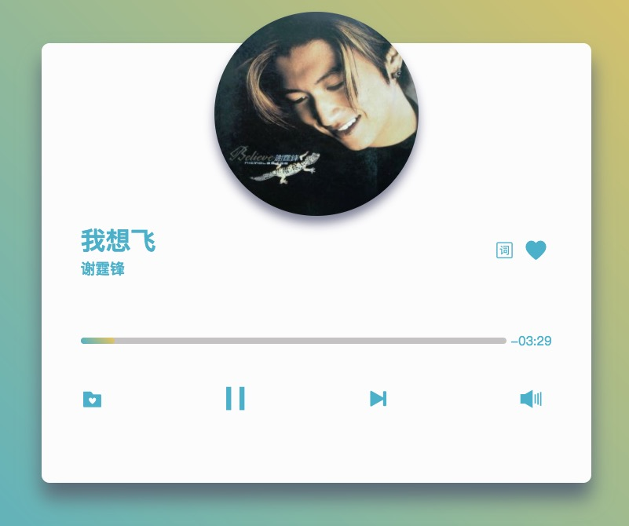
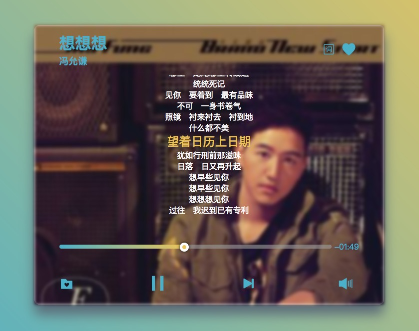
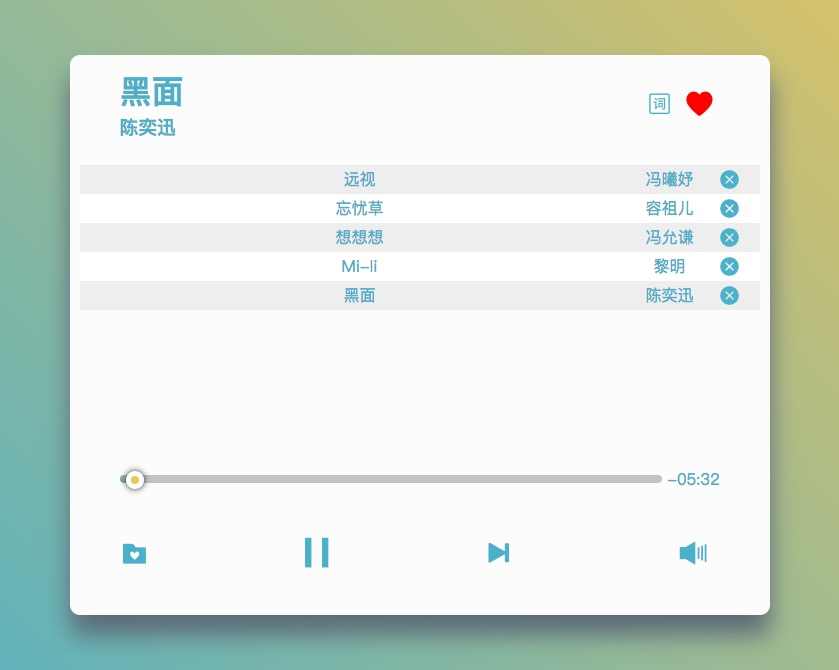

# 粤语音乐电台-简单轻量的在线音乐电台

[预览点这里](https://yangzhiyang.github.io/My-music/)
### 主界面

### 歌词界面

### 收藏列表界面

## 功能：
2017年9月11日更新：
- 页面加载自动播放
- 点击收藏夹图标、歌词图标分别切换收藏列表、歌词界面
- 点击控制台的播放/暂停、下一曲 、音量按钮可控制播放
- 在播放音乐时点击进度条可跳跃到指定的播放进度
- 播放音乐中时，进度条右侧的时间会显示当前歌曲的剩余时间
- 歌词根据播放进度对当前一句歌词高亮显示，并同步滚动保证当前歌词显示在可见区域
- 点击心形按钮可将当前歌曲添加至收藏列表
- 如果歌曲已收藏，则心形按钮显示红色，此时点击心形按钮，可将歌曲从收藏列表中删除
- 点击收藏歌曲列表中的歌曲时，播放被点击的歌曲
- 点击收藏歌曲最右侧的删除按钮，可从列表中删除该歌曲
- 收藏的歌曲列表存储在用户本地浏览器中，刷新或关闭页面不受影响，再次在本地浏览器打开该应用页面时自动加载用户的收藏列表

## 主要相关技术：
HTML、CSS(3)、JQuery、JavaScript、Ajax、flex布局、localStorage、Promise
- Promise对象封装的 Ajax 
- (ES6)Promise包装了一个音乐加载的异步操作。采用链式的then方法，指定一组按照次序调用的回调函数：通过Ajax获取当前歌曲，状态为resolve时执行第一个resolve回调函数（渲染音乐信息并返回当前音乐id），待状态为resolve后，执行把第二个resolve回调函数（前一个resolve回调函数的返回值作为参数，通过Ajax获取当前音乐歌词）待状态为resolve后，渲染歌词
(ES6)使用模板字符串，渲染音乐信息/歌词
- HTML5媒体元素Audio类型：创建Audio对象audioObject，调用audioObject.play()播放音乐，调用audioObject.pause()暂停音乐，‘ended’监听音乐播放结束，当currentTime更新时触发timeupdate事件（以此事件做滚动歌词功能）
- 使用CSS3：animation等属性提升用户体验好感度
- localStorage: 实现用户本地收藏歌词功能